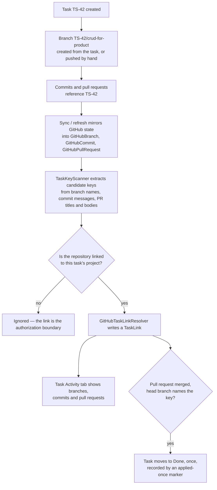
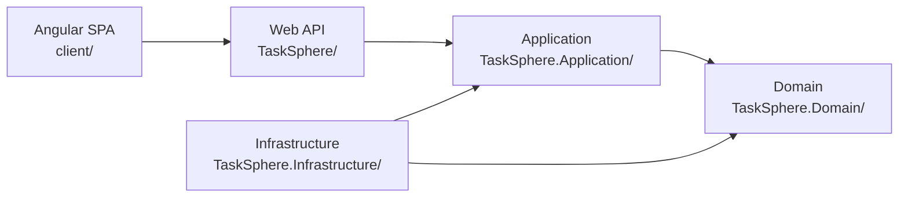

# TaskSphere


**Team project management where your GitHub work finds its own way onto the board.**

Create a company, invite members, plan sprints, track tasks — and connect a GitHub App so that
branches, commits and pull requests resolve onto the tasks they belong to, automatically. Mention
`TS-42` in a branch name or a commit message and that task's Activity tab shows the work. Merge the
pull request and the task moves to Done on its own.

---

## What it does

TaskSphere is a multi-tenant project management platform. A **company** is the tenant boundary;
inside it live projects, sprints, tasks, members and a per-project chat. Company admins manage
everything, while regular members see only the projects they belong to — enforced server-side on
every single query, not just at the controller door.

The part worth looking at is the **GitHub integration**. Most tools make you paste links between a
task and its code. TaskSphere derives the connection from the work itself.

---

## Features

### Planning
- **Projects & sprints** — backlog, sprint planning, one active sprint per project
- **Tasks** — assignment to sprint members, status tracking, business-rule validation on every
  transition
- **Human-readable task keys** — every task gets a `TS-42`-style key, allocated atomically so two
  concurrent creates can never collide on the same number

### GitHub integration
- **GitHub App connection** — install once per company, OAuth callback, revocable
- **Repository ↔ project links** — an explicit many-to-many that doubles as an authorization
  boundary
- **Task activity** — branches, commits and pull requests mirrored and resolved onto tasks by key
- **Create a branch from a task** — generates `TS-42/crud-for-product` off the repository's default
  branch, links it to the task before the response returns
- **merge → Done** — a merged pull request whose head branch names a task key moves that task to
  Done, exactly once
- **Inherited commits** — commits ahead of the default branch are attributed to the task that owns
  the branch, so a task shows its work without every commit needing its own key
- **Refresh on open** — opening a task's Activity tab pulls fresh GitHub state behind a cooldown,
  so members see current data without an admin pressing Sync

### Collaboration
- **Real-time per-project chat** — SignalR, with image sharing by paste or upload

### Governance
- **Audit logging** — a background pipeline records mutating requests per company, with a
  charted dashboard
- **Multi-tenancy** — every resource carries a `CompanyId`, and every query is scoped to it
- **Role-based access control** — company admin vs. project member
- **Soft deletes** — global query filters exclude deleted records everywhere by default

---

## How the GitHub integration works



Task keys are matched **case-sensitively in uppercase only** — the scanner's pattern is
`[A-Z][A-Z0-9]{1,9}-[1-9][0-9]{0,8}` with word boundaries on both sides. This is deliberate: it
keeps `ts-42` in a slugged branch name from matching, and it is why branch generation slugs only
the *title* and leaves the key uppercase.

---

## Architecture

Clean Architecture, four layers, dependencies pointing inward.



```
TaskSphere/                  # Web API — controllers, filters, DI, JWT config
TaskSphere.Application/      # Services, interfaces, validators, AutoMapper profiles
TaskSphere.Domain/           # Entities, DTOs, enums, Result<T>, TaskKeyScanner
TaskSphere.Infrastructure/   # EF Core DbContext, repositories, migrations, GitHub services
TaskSphere.Tests/            # xUnit — integration tests against a real migrated database
client/                      # Angular SPA
```

A request flows one way: controller → application service → repository → EF Core. Services return
`Result<T>` rather than throwing, and `ApiBaseController.FromResult<T>()` maps that to `200`, `403`
or `400` at the edge.

Backed by **518 backend tests** and **150 client tests**.

---

## Design notes

**The repository → project link is an authorization boundary, not a label.**
A task can only ever resolve onto activity in repositories linked to *its own* project. The check
runs on every read rather than at write time, so unlinking a repository hides its activity
immediately, and re-linking restores it with no cleanup pass. Treating the link as a label instead
would have made every company's commits visible on every company's tasks.

**merge → Done is an applied-once marker, not a state edge.**
Sync overwrites a pull request's state on every pass, so "just became merged" is unobservable after
the write. Instead the transition fires on `State == Merged && MergeTransitionAppliedAtUtc IS NULL`
and stamps the marker even when it skips. A link is a fact and is safe to re-insert; a status change
is an *action*, and re-applying it every sync would overrule a lead who deliberately moved the task
back.

**Commit inheritance is baked at ingest.**
Commits ahead of the repository's default branch are attributed to the task owning the branch, and
that ahead-ness is recorded as a historical fact at the moment of ingest rather than recomputed
later. The set is add-only, so an inherited commit survives the merge that would otherwise make it
unreachable — which is what you want when reading a task's history six months on.

**Multi-tenancy is enforced per query, not per controller.**
A `[RequireCompany]` filter lifts `companyId` off the JWT into `HttpContext.Items`, and every query
scopes to it. Access for `User`-role callers goes through `IAccessControlService` inside the
application layer, so a new endpoint that forgets the check doesn't silently leak across projects.

**`Result<T>` instead of exceptions for expected failures.**
Authorization refusals and validation failures are ordinary outcomes, not exceptional ones. Making
them values keeps the mapping to HTTP in exactly one place and keeps control flow readable.

---

## Access control

| Role | Access |
|---|---|
| `Company` | Admin — manages every project, member and repository link in the company |
| `User` | Member — only the projects they have been explicitly added to |

Membership is re-checked server-side via `IAccessControlService` on every data operation. Some
GitHub endpoints are deliberately split across the two: reading a task's activity is open to
members, while a company-wide sync is admin-only, because it spends a shared GitHub rate-limit
budget.

---

## Tech stack

| Layer | Technology |
|---|---|
| Frontend | Angular 21, TypeScript 5.9, Tailwind CSS 4 |
| Charts | Chart.js 4 + ng2-charts |
| Real-time | SignalR (`@microsoft/signalr` 10) |
| Backend | ASP.NET Core on `net10.0`, C# |
| ORM | Entity Framework Core 9.0.10 + SQL Server |
| Auth | JWT Bearer + ASP.NET Identity |
| Integration | GitHub App — JWT-signed app auth, installation tokens, OAuth user flow |
| Validation | FluentValidation 11.11 |
| Mapping | AutoMapper 13 |
| Testing | xUnit (backend, against a real migrated database) + Vitest (client) |
